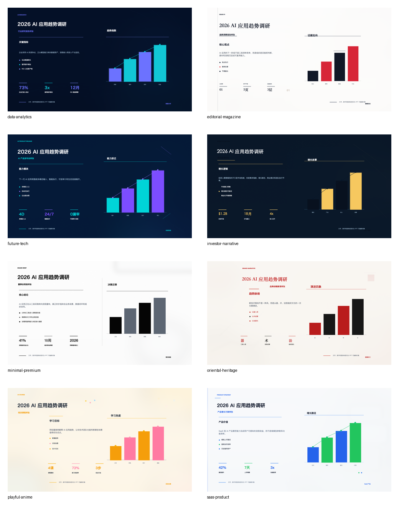

# Codex Visual PPT Deck Builder

<p align="center">
  <a href="#中文">中文</a>
  ·
  <a href="#english">English</a>
</p>

<p align="center">
  <a href="https://github.com/DwDestiny/codex-visual-ppt-deck-builder/blob/main/LICENSE"></a>
  
  
  
</p>

<p align="center">
  <strong>不是把 Markdown 塞进幻灯片。</strong><br>
  这是一个让 Codex 像真正的 PPT 设计师一样工作的 skill：先定主题和故事，再选视觉风格，最后交付可编辑的 PowerPoint。
</p>



<a id="中文"></a>

## 中文

`visual-ppt-deck-builder` 是一个面向 Codex 的视觉型 PPTX skill。它的目标很明确：把一个主题变成一套能继续编辑、能商务交付、能保留设计感的 PowerPoint，而不是一组看起来还行但无法修改的整页截图。

它特别适合：

- 商业计划书、融资路演、咨询汇报
- AI 产品发布会、趋势报告、行业研究
- 课程课件、品牌故事、公开演讲
- SaaS / App / 工具类产品演示
- 需要透明素材、图表、背景和文案共同排版的 PPT

### 它解决什么问题

很多 AI PPT 工具会走两条歪路：

1. **像文档转 PPT**：内容是可编辑的，但页面像模板填空。
2. **像海报生成器**：视觉很好看，但整页变成图片，标题、数字、图表都不能改。

这个 skill 选择第三条路：

- 先用图片能力生成完整视觉母稿，判断风格、字体气质、排版密度和整体氛围。
- 再把母稿反拆成 clean background、透明素材、坐标蓝图和可编辑 PPT 层。
- 最后用 PowerPoint 原生文本、形状、图表和图片层重建页面。

结果是：**看起来像认真设计过，交付时又能继续改。**

### 核心能力

- **8 套默认风格库**：简约高级、活泼动漫、数据分析、国潮东方、未来科技、编辑杂志、SaaS 产品、投资人叙事。
- **风格不是换皮**：默认要求至少 6 种不同版式变体，标题语法、指标语法和图表语法必须随风格变化。
- **可编辑 PPTX 样板**：每套风格都有真实 `.pptx` 样板和从 PPTX 导出的 PNG 预览。
- **效果图母稿优先**：先出完整效果图，再反拆干净背景和可编辑层，避免“样张很好看，最终做不出来”。
- **无框融合式排版**：禁止用大白框、大图表框、小指标框糊住背景；文本和图表要嵌入背景预留区。
- **坐标蓝图**：每页按 `13.333 x 7.5` inches 规划标题区、正文区、图表区、指标区、视觉焦点区和保护留白区。
- **质量门禁**：检查页数、布局数、claim、source、模板词、可读性和可编辑对象。

### 安装

查看仓库里的 skill：

```bash
npx skills add DwDestiny/codex-visual-ppt-deck-builder --list
```

安装到 Codex 全局：

```bash
npx skills add DwDestiny/codex-visual-ppt-deck-builder --skill visual-ppt-deck-builder -g -a codex -y
```

### 快速使用

```text
Use $visual-ppt-deck-builder to create an editable PPTX deck about 2026 AI application trends.
```

或者中文：

```text
用 $visual-ppt-deck-builder 做一套《2026 AI 应用趋势调研》的可编辑 PPT，先给我 8 套风格样张，再确认大纲和页数。
```

### 标准工作流

1. **确认主题**：主题、受众、场景、语气、品牌约束。
2. **确认大纲**：先定故事线，不直接做页面。
3. **确认风格**：输出 8 套独立风格样张，每套都是可编辑 PPTX 样板导出的 PNG。
4. **确认页数与每页内容**：每页写清标题、核心 claim、素材、图表和证据口径。
5. **逐页生成素材**：背景、透明 PNG、图表、文案和版式分层生成。
6. **组合 PPTX**：正文、图表、标签和数字必须可编辑。
7. **质量验收**：跑 deck spec 检查和页面预览，没过不交付。

### Demo

风格库 v1：

- 总览图：`effect-tests/style-library-v1/style-library-contact-sheet.png`
- 8 套 PPTX 样板：`effect-tests/style-library-v1/samples/`
- 8 张 PNG 预览：`effect-tests/style-library-v1/previews/`
- 风格 spec：`effect-tests/style-library-v1/style-candidate-spec.json`
- 视觉 QA：`effect-tests/style-library-v1/style-visual-qa.json`

母稿反拆可编辑样张：

- PPTX：`effect-tests/reference-first-approved/anime-editable-sample.pptx`
- Deck spec：`effect-tests/reference-first-approved/deck_spec.json`

基础 demo：

- PPTX：`demos/visual-ppt-deck-builder/sample-visual-ppt-deck.pptx`
- Spec：`demos/visual-ppt-deck-builder/sample-deck-spec.json`

### 本地验证

```bash
python -m unittest discover -s tests -p 'test_visual_ppt_deck_builder.py'
node --check skills/visual-ppt-deck-builder/scripts/build_style_candidates.js
node --check skills/visual-ppt-deck-builder/scripts/build_visual_pptx.js
node --check skills/visual-ppt-deck-builder/scripts/validate_deck_quality.js
node --check skills/visual-ppt-deck-builder/scripts/build_deck_preview.js
```

### 仓库结构

```text
skills/
  visual-ppt-deck-builder/
    SKILL.md
    agents/openai.yaml
    scripts/
      build_style_candidates.js
      build_visual_pptx.js
      validate_deck_quality.js
      build_deck_preview.js
    references/
      deck-spec-schema.md
      research-notes.md
tests/
  test_visual_ppt_deck_builder.py
demos/
  visual-ppt-deck-builder/
  preview/
effect-tests/
  style-library-v1/
  reference-first-approved/
```

### 边界

这个仓库只做 PPT。透明背景素材和连续动画素材已经拆到另一个仓库：

- `transparent-visual-assets`
- `sprite-animation-assets`

如果你要做网站、PPT、App 里用的透明 PNG，应该去素材仓库；如果你要做一套可编辑、可交付的视觉 PPT，才用这个仓库。

<p align="right"><a href="#codex-visual-ppt-deck-builder">返回顶部</a> · <a href="#english">English</a></p>

---

<a id="english"></a>

## English

`visual-ppt-deck-builder` is a Codex skill for creating visual, editable PowerPoint decks. It is not a Markdown-to-slides converter and not a full-page image generator. Its job is to help Codex work like a real presentation designer: define the story, choose the visual direction, generate design assets, then rebuild the deck as editable PPTX layers.

Use it for:

- Business plans, investor decks, consulting reports
- AI product launches, trend reports, industry research
- Course decks, brand stories, keynote presentations
- SaaS / app / product walkthroughs
- Decks that need backgrounds, transparent assets, charts, and editable copy to work together

### Why this exists

Most AI presentation workflows fall into one of two traps:

1. **Document-to-slide output**: editable, but visually generic.
2. **Poster-like image output**: visually attractive, but impossible to edit.

This skill takes a third path:

- Generate a full-page visual reference first, so the user can judge style, typography, density, and composition.
- Decompose the approved reference into a clean background, transparent assets, coordinate blueprint, and editable PPT layers.
- Rebuild the slide with native PowerPoint text, shapes, charts, and image layers.

The result: **slides that look designed, but still behave like PowerPoint.**

### Core Features

- **8 default visual directions**: Minimal Premium, Playful Anime, Data Analytics, Oriental Heritage, Future Tech, Editorial Magazine, SaaS Product, Investor Narrative.
- **Editable PPTX samples**: every style candidate includes a real `.pptx` sample and a PNG preview exported from that PPTX.
- **Reference-first workflow**: create the desired visual effect first, then decompose it into editable production layers.
- **No-box composition rule**: no large white text boxes, no large chart containers, no framed metric tiles. Text and charts must sit inside planned safe zones.
- **Coordinate blueprints**: every candidate plans title, copy, chart, metrics, visual focus, and protected empty zones on a `13.333 x 7.5` inch slide.
- **Quality gates**: validates slide count, layout diversity, claims, sources, placeholder text, readability, and editable object structure.

### Install

List available skills:

```bash
npx skills add DwDestiny/codex-visual-ppt-deck-builder --list
```

Install globally for Codex:

```bash
npx skills add DwDestiny/codex-visual-ppt-deck-builder --skill visual-ppt-deck-builder -g -a codex -y
```

### Quick Start

```text
Use $visual-ppt-deck-builder to create an editable PPTX deck about 2026 AI application trends.
```

### Workflow

1. **Confirm the topic**: audience, use case, tone, brand constraints.
2. **Confirm the outline**: define the story before designing slides.
3. **Confirm the visual direction**: generate 8 separate editable PPTX style samples and PNG previews.
4. **Confirm slide count and slide content**: define title, claim, assets, chart, and evidence for each page.
5. **Generate assets per slide**: backgrounds, transparent PNGs, charts, copy, and layout.
6. **Assemble PPTX**: copy, charts, labels, and numbers stay editable.
7. **Run quality gates**: validate the deck and preview pages before delivery.

### Demo Artifacts

Style library v1:

- Contact sheet: `effect-tests/style-library-v1/style-library-contact-sheet.png`
- 8 PPTX samples: `effect-tests/style-library-v1/samples/`
- 8 PNG previews: `effect-tests/style-library-v1/previews/`
- Style spec: `effect-tests/style-library-v1/style-candidate-spec.json`
- Visual QA: `effect-tests/style-library-v1/style-visual-qa.json`

Reference-first editable sample:

- PPTX: `effect-tests/reference-first-approved/anime-editable-sample.pptx`
- Deck spec: `effect-tests/reference-first-approved/deck_spec.json`

Basic demo:

- PPTX: `demos/visual-ppt-deck-builder/sample-visual-ppt-deck.pptx`
- Spec: `demos/visual-ppt-deck-builder/sample-deck-spec.json`

### Local Verification

```bash
python -m unittest discover -s tests -p 'test_visual_ppt_deck_builder.py'
node --check skills/visual-ppt-deck-builder/scripts/build_style_candidates.js
node --check skills/visual-ppt-deck-builder/scripts/build_visual_pptx.js
node --check skills/visual-ppt-deck-builder/scripts/validate_deck_quality.js
node --check skills/visual-ppt-deck-builder/scripts/build_deck_preview.js
```

### Scope

This repository is only for visual PPTX deck generation. Transparent PNG assets and sprite animation assets live in the separate visual asset skills repository.

<p align="right"><a href="#codex-visual-ppt-deck-builder">Back to top</a> · <a href="#中文">中文</a></p>

## License

MIT
